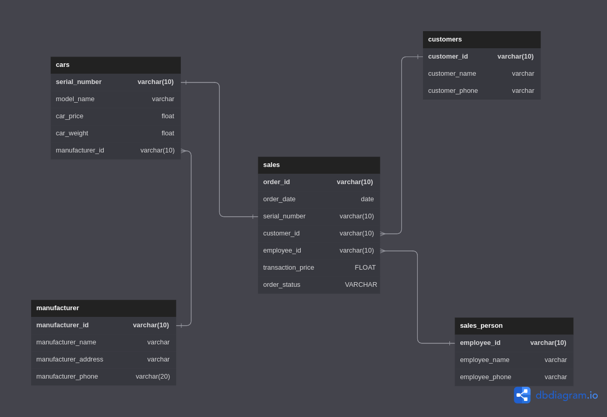

1. Set password and username in dockerfile
2. build dockerfile with `docker build -t postgres_image ./`
3. init.sql in /sql/tables/ will be copy to dir in docker image and triggered when container starts running
4. Run container with `docker run --name postgres_db -p 5432:5432 postgres_image:latest`
5. The SQL to generate the report to the following questions are saved in  /sql/reports/. 

	1.  I want to know the list of our customers and their spending.
	2. I want to find out the top 3 car manufacturers that customers bought by sales (quantity) and the sales number for it in the current month.

