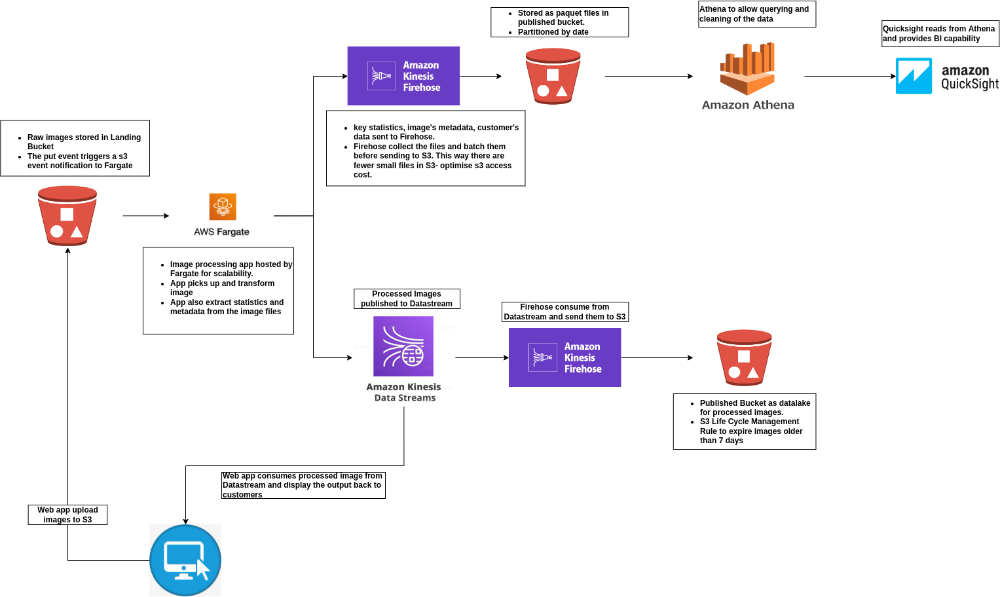

 1. Web APP upload file to Landing bucket, which fire S3 event notification to activate the image processing logic hosted in Fargate 
 2. Fargate transform image and output to Kinesis Datastream, which is then consumed by Firehose and put to Published S3 bucket. S3 Life cycle management rule to delete processed image after 7 days. 
 3. Fargate app also extract metadata and user statistic, and publish it to Firehose, which collect and batch data before sending off to S3. Once there, data analyst can read via Athena and draw graph via Quicksight.

Pro:
- Fargate app has no 15mins time out limit as lambda function
- Fargate is serverless and no need to manage infra
- Firehose accumulate files before sending to S3. Reduce number of small files in S3, thus optimise on S3 access cost

Cons:
- Fargate cant scale up or down quickly


 ```

```
